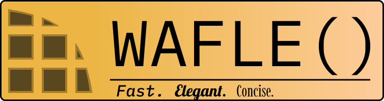

This is WAFLE pre-release, I am building

<h1 align="center">
    
</h1>


<div align="center">
    An awesome way to transform iterables.
</div>

<div align="center">
    <br/>
    
    
</div>

<hr/>

## Let's speak Python before English 😎

```py
import wafle as wf

(
    wf.mrange(1, 101)
    | (lambda x: ("Fizz" * (x % 3 == 0) + "Buzz" * (x % 5 == 0)) or str(x))
    | print
).void()
```

Not convinced? good job! cause I wouldn't be either, You must be thinking "that's just
a simple fizzbuzz which doesn't use any partials" right?

If you thought that you would be right, However the solution is in the same sentence,
using partials!

You may think that is unnecessary complexity, more thinking, but the more general idea
behind partials, currying has been around for a long time. You have to try it to get
hooked to it.

Here is some real code from [Advent of Code 2023 Day 18](https://adventofcode.com/2023/day/18)

```py
# AOC23 Day 18 Part 2 input parsing
from wafle import mapper, star, rpartial
import operator as op

dl = [1j, 1+0j, -1j, -1+0j]

a = mapper.of(open("day18/input.txt", "r").readlines()) | str.strip | str.split | rpartial(op.getitem, 2) | rpartial(op.getitem, slice(2, -1)) | (lambda k: dl[int(k[-1])] * int(k[:-1], 16))
```

WAFLE was created after AoC Day 17, so the usage you are looking at is the very very first
version

If you have a problem with writing out `rpartial` or `partial` you can always alias the
imports.

Here's some more short examples
```py
import wafle as wf

print(wf.mrange(int(input("Enter a number: "))) >= sum)
```

```py
import wafle as wf
import itertools as it

# make partial islice to use conviniently
# I promised to add all typesafe itertools partials soon
islice = wf.with_rightargs(it.islice)  # type: ignore

_ = wf.M(input("Numbers: ").split()) | int > islice(None, None, 2)  # type: ignore
print(_ >= sum)
```

Wanna know the best part? 90% of the code written with wafle is typesafe!

## Design Goals
 - Minimal overhead
 - **Zero iteration overhead**
 - Concise syntax
 - Intuitive usage
 - Compatibility with other iterator tools and some other abstractions
 - Ability to produce one-liners for most transformations over data
 - Type-safe
 - IDE support, no black magic and remain statically analyzab
 - Interoperability, WAFLE even tries to be compatible with its alternatives

## Why?

Just why did I make another one of these piping interator chaining utility libraries?
The reason is quite simple, my own opinions suit me the best.

After AoC Day 17, I looked at about 13 different functional programming libraries, ranging in
popularity from just 12 stars to having 2k+ stars, I even stumbled on a python like functional
language!

But I didn't like any, some of them were too bound in theory or complex, some were just too
feature-less to actually make a difference.

So I made one with the sole purpose of making fast and short "one-liners" to transform data,
(Yes I also looked at reactive streams)

Wizzy's Awesome Functional LibrarE (WAFLE) draws inspiration from various sources and mixes my
opinion, the correct and the simplest opinion into it. Since WAFLE is opinianated, you don't
have to think, just do. I did the thinking and research for you.

## Contributing

Please get in touch with me, since the project is in its early stages!

<div align="center">
    <h1></h1>
    <h6>Thanks to <a href="https://github.com/WizzyGeek">@WizzyGeek</a> for everything
    <br/>
    © WizzyGeek 2021</h6>
</div>
